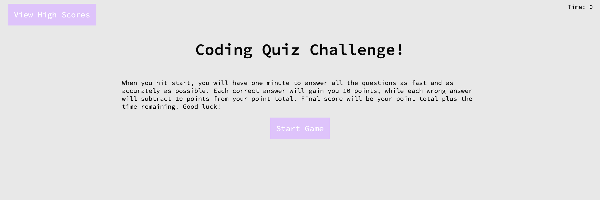

# **Coding Quiz Game**

## **Description**

This website was created to test the user’s knowledge of basic coding. This game has a timer and scoring system that challenges both the user’s accuracy and speed.

## **Usage**

Navigate to this URL: http://github.io/jnc2248/coding-quiz-game/

Instructions on how to play the game will be displayed on the welcome page. Press the high score button in the top left corner at any time to view all the saved high scores. Once you press start, the timer in the top right corner will begin to run. At the end of the game, you will have the option to save your initials and score.

